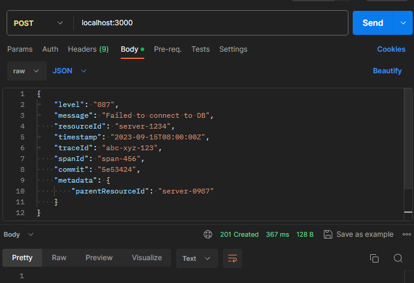
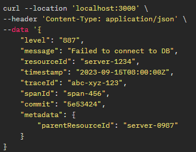
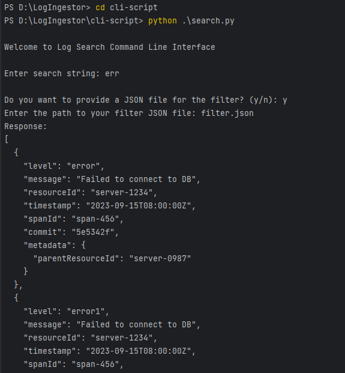
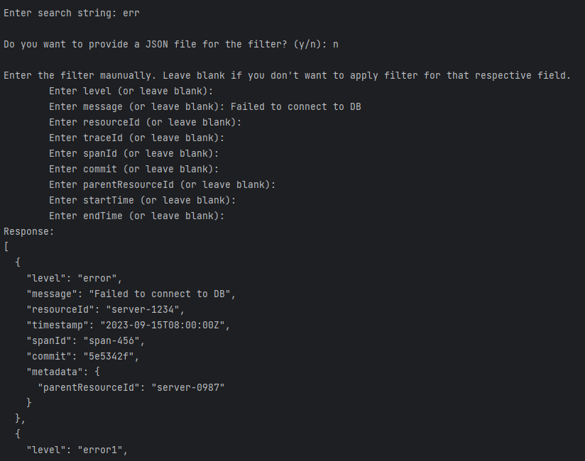
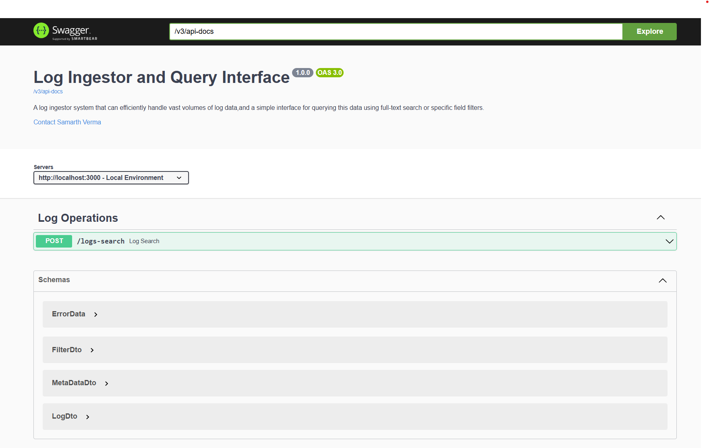

# Log Ingestor and Query Interface

A Log Ingestor System that can efficiently handle vast volumes of log data, and a simple interface for querying this data using full-text search or specific field filters.

### Architecture 


## Features
### Log Ingestor System
  - Large volume of logs can be ingested via an HTTP server, by sending `POST` HTTP request to the endpoint `http://localhost:3000`.
  - Request Body (JSON) format:
    ```json 
    {
      "level": "error",
      "message": "Failed to connect to DB",
      "resourceId": "server-1234",
      "timestamp": "2023-09-15T08:00:00Z",
      "traceId": "abc-xyz-123",
      "spanId": "span-456",
      "commit": "5e5342f",
      "metadata": {
        "parentResourceId": "server-0987"
      }
    }

    ```
### Query Interface
  - Command Line Interface (CLI) for fast and efficient full-text search across logs. Filters based on:
     - level
     - message
     - resourceId
     - timestamp
     - traceId
     - spanId
     - commit
     - metadata.parentResourceId
   - Logs can be searched within specific date ranges.
   - Regular expressions are used for search.
   - Multiple filters can be combined.
   - Provision for real-time log ingestion and searching capabilities.

## System Requirements

Before you begin, ensure your system meets the following requirements:

- **Operating System:** Windows 10/11
- **Java:** Version 17.0.0 or higher
- **Apache Maven:** Version 3.9.0 or higher
- **Apache Kafka:** Version 3.6.0 or higher
- **Python:** Version 3.6.0 or higher
- **MongoDB:** Version 7.0.2 or higher (Or can use MongoDB Atlas)
- **Git**
- **IntelliJ IDEA Community Editon**

## Setup
### MongoDB Setup: 

This project uses MongoDB as its Database. Follow these steps to set up the required MongoDB database and collection: 
   - Go to MongoDB Atlas/Compass and create a Database named `log-ingestor`.
   - Inside the "log-ingestor" Database, create a Collection named `log`. 

### Apache Kafka Setup: 
This project uses Apache Kafka. Follow these steps to start the Kafka Zookeeper and Kafka Server. 
   - Run the following commands in order to start all services in the correct order:
     ```bash
        .\bin\windows\zookeeper-server-start.bat .\config\zookeeper.properties
     ```
   - Open another terminal session and run:
     ```bash
        .\bin\windows\kafka-server-start.bat .\config\server.properties
     ```
### Spring Boot Application Repository Setup: 
This project is a Spring Boot Application. Follow these steps to setup and application repository. 
   - Open a terminal session in a directory of your choice, run the following to clone the repository:
     ```bash
        git clone https://github.com/samarth2804/Log-Ingestor-and-Query-Interface
     ```
### Import Project into IntelliJ IDEA

- Open IntelliJ IDEA.
- Click on `File` -> `Open...` and select the project directory (`LogIngestor`).
- IntelliJ IDEA will automatically recognize it as a Maven project and import the necessary dependencies.

### Configure Application

- Open `src/main/resources/application.properties` for application-specific configurations.
- Modify the configurations as needed.
  ```properties
     server.port=3000

     spring.data.mongodb.auto-index-creation=true
     spring.data.mongodb.uri=mongodb://localhost:27017
     spring.data.mongodb.database=log-ingestor

     spring.kafka.producer.bootstrap-servers=localhost:9092
     spring.kafka.consumer.bootstrap-servers=localhost:9092

     spring.kafka.producer.key-serializer=org.springframework.kafka.support.serializer.StringOrBytesSerializer
     spring.kafka.producer.value-serializer=org.springframework.kafka.support.serializer.JsonSerializer
     spring.kafka.consumer.key-deserializer=org.apache.kafka.common.serialization.StringDeserializer
     spring.kafka.consumer.value-deserializer=org.springframework.kafka.support.serializer.JsonDeserializer

     spring.kafka.consumer.group-id=log-consumer
     spring.kafka.consumer.max.poll.records=100
     spring.kafka.consumer.auto-offset-reset=earliest
     spring.kafka.consumer.properties.spring.json.trusted.packages=com.sam.pojo
  ```
### Run the Application
- Open the `LogIngestorApplication` class located in `src/main/java/com/sam`.
- Right-click on the file and select `Run 'Application'`.
- Alternatively, you can run the application from the command line (make sure in the project directory):
    ```bash
    ./mvnw clean spring-boot:run
    ```
- The application will be accessible at `http://localhost:3000`.

### Start the Command Line Interface
- Open a terminal session in the project directory and then change directory to `cli-script` using
    ```bash
    cd cli-script
    ```
- To start CLI, run the following command to start the Python Script:
    ```bash
    python .\search.py
    ```
- You might need to install the `requests` library if not already installed. This can be done by running:
    ```bash
    pip install requests
    ```


## Usage
### Add/Upload Logs
- Logs can be uploaded by sending `POST` HTTP request sto the endpoint `http://localhost:3000`.
Request Body (JSON) format:
   ```
   {
      "level": "error",
      "message": "Failed to connect to DB",
      "resourceId": "server-1234",
      "timestamp": "2023-09-15T08:00:00Z",
      "traceId": "abc-xyz-123",
      "spanId": "span-456",
      "commit": "5e5342f",
      "metadata": {
      "parentResourceId": "server-0987"
      }
   }
   ```
- This can done by using:
  - Postman
  
  - Curl

    
  
    
  

### Search Logs
- Logs can be searched by making use of the Command Line Interface. Start the CLI as previously discussed. Open a terminal session in the `logIngestor/cli-script` directory. Run the command:
    ```bash
    python .\search.py
    ```
- You will prompted to enter the `search string`. If the `search string` is empty, search will be done only on the basis of filters. For example, if `search string` is empty, and filter specifies that `message` field is "Failed to connect to DB", then all logs whose `message` field is set to "Failed to connect to DB" will be returned.
- Next you can add filters by either providing a JSON file name or entering the filter values manually.
- The cli-script directory already contains a JSON file named `filter.json`. You can use this JSON file to apply the appropriate filters. For the fields for which you don't want to set filters, keep their values as `null`.
  Following is an example. Only logs which contain the `search string` and whose `message` field is "Failed to connect to DB" and `spanId` field is "span-456" will be returned. Following is an example. Only logs whose `message` field is "Failed to connect to DB" and `spanId` field is "span-456" will be returned. 
   ```
   {
       "level": null,
       "message": "Failed to connect to DB",
       "resourceId": null,
       "startTime": null,
       "endTime": null,
       "traceId": null
       "spanId": "span-456",
       "commit": null,
       "metadata": {
          "parentResourceId": null
       }
   }
   ```
   
- Similarly for searching logs between time ranges you need the set the `startTime` and `endTime` fields.
- If you wish to use the `filter.json` file, enter "fiter.json" when prompted for the filename/filepath.
- Alternatively you can also the enter the filters for each field manually. You will be promoted to enter the values of the field filters. For the fields for which you don't want to set filters, leave them blank.
  

### Using Swagger UI
- Alternatively you can use the `Swagger-UI` to query/search the logs. This can be accessed by opening `http://localhost:3000` in your browser.



